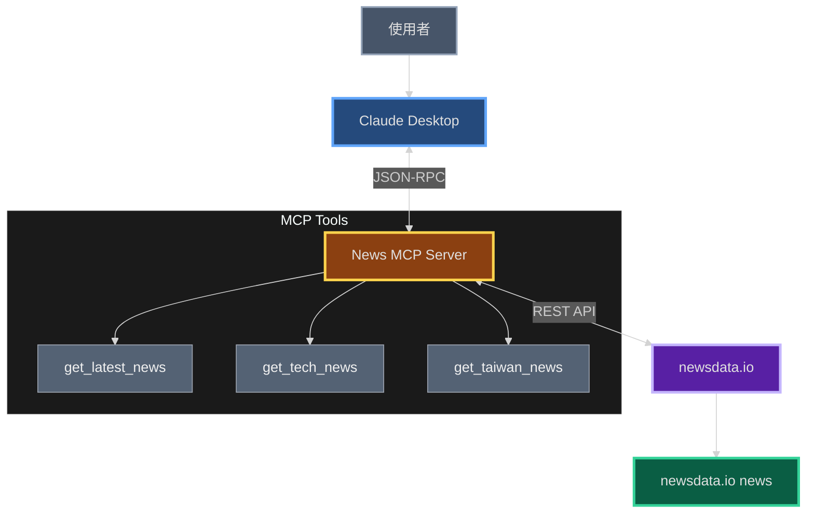
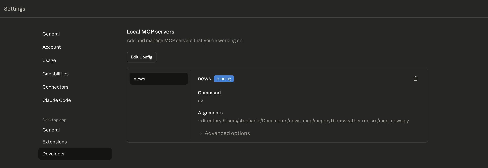
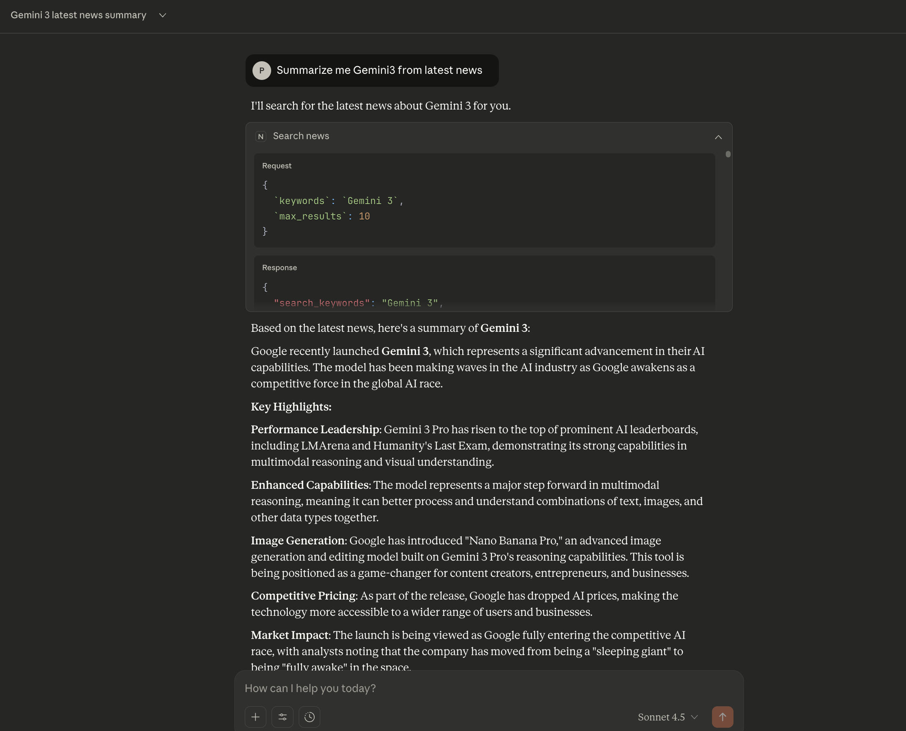

## 前言

前陣子剛好處於職涯的轉換期，從 Software Engineer 轉變為顧問 Consultant 的角色。在適應新身份和不同工作節奏的過程中，部落格也跟著停更了一段時間。現在好不容易閒下來，是時候把這幾個月「搗鼓」的東西整理出來跟大家分享了～

> 還記得上一篇 [教學：安裝 MCP 至 Claude Desktop，善用 AI 加速工作生產力](https://chungftf.github.io/2025/08/02/How-to-install-MCP-in-Claude/) 提到如何把現成的 MCP server 裝進 Claude 嗎？

> 今天我們不只要「用」，更要進一步「造」——自己動手建構一個本地的 MCP server，打造專屬於你的 AI 小工具。

## 為什麼想做這個？

這個靈感其實來自於我很日常的一個 idea。 

每天早上醒來或通勤時，習慣做的第一件事大概就是滑手機看新聞。

但我通常只關注科技、娛樂與股市這類特定主題，現在的演算法雖然強大，但內容品質都不一定穩定，或者我需要瀏覽多個來源了解同個主題但不同解讀面向的新聞。

所以我產生了一個想法：能不能透過 API 把新聞抓下來，讓 LLM 幫我統整？

所以目標很明確：利用自定義的 MCP server 串接新聞 API，讓 Claude 能夠根據我的指令，直接調用、過濾並總結我真正想看的內容。

> **因此我抱持「想偷懶所以變勤勞」的想法，開始了這次的實作**

## 技術架構

整個系統分為三層：
1. **Claude Desktop** - 使用者介面，透過自然語言下指令
2. **News MCP Server** - 我們要自己建的部分，使用 FastMCP 框架
3. **newsdata.io API** - 外部新聞資料來源，支援 200+ 國家、40+ 語言


## 環境準備

首先安裝Python 套件管理工具 `uv` ：

```bash
# 安裝 uv
curl -LsSf https://astral.sh/uv/install.sh | sh

# 建立專案
mkdir news-mcp && cd news-mcp
uv init

# 安裝相依套件
uv add "mcp[cli]>=1.9.4" "requests>=2.32.4"
```

接著到 [newsdata.io](https://newsdata.io) 註冊免費帳號，取得 API Key（免費版每日 200 次請求）。

## 核心程式碼

建立 `src/mcp_news.py`，核心概念就是用 `@mcp.tool()` decorator 把函數包裝成 MCP 工具：

```python
from typing import Any, Optional
from mcp.server.fastmcp import FastMCP
import requests
import os

# 初始化 MCP server
mcp = FastMCP("news", dependencies=["requests"])

# API 設定
NEWSDATA_API_KEY = os.getenv("NEWSDATA_API_KEY")
BASE_URL = "https://newsdata.io/api/1"

@mcp.tool()
def get_latest_news(
    country: Optional[str] = None,
    category: Optional[str] = None,
    language: str = "en",
    query: Optional[str] = None,
    max_results: int = 10
) -> dict[str, Any]:
    """
    Get latest news articles
    
    Args:
        country: Country code (e.g., 'us', 'tw', 'jp')
        category: News category (e.g., 'technology', 'business')
        language: Language code (default: 'en')
        query: Search keywords
        max_results: Maximum results (default: 10)
    """
    url = f"{BASE_URL}/news"
    params = {
        "apikey": NEWSDATA_API_KEY,
        "language": language,
    }
    
    if country:
        params["country"] = country
    if category:
        params["category"] = category
    if query:
        params["q"] = query
    
    response = requests.get(url, params=params)
    data = response.json()
    
    articles = data.get("results", [])[:max_results]
    
    return {
        "total_results": len(articles),
        "articles": [
            {
                "title": article.get("title"),
                "description": article.get("description"),
                "link": article.get("link"),
                "source": article.get("source_id"),
                "published_at": article.get("pubDate"),
            }
            for article in articles
        ]
    }

@mcp.tool()
def get_tech_news(language: str = "en", max_results: int = 10) -> dict[str, Any]:
    """Get latest technology news"""
    return get_latest_news(category="technology", language=language, max_results=max_results)

@mcp.tool()
def get_taiwan_news(category: Optional[str] = None, max_results: int = 10) -> dict[str, Any]:
    """Get latest news from Taiwan in Chinese"""
    return get_latest_news(country="tw", category=category, language="zh", max_results=max_results)

if __name__ == "__main__":
    mcp.run()
```

### LLM 如何知道要用哪個 Function？

這裡的關鍵在於 **FastMCP 會自動把 Python 函數轉換成 JSON Schema**，讓 LLM 能理解。

當你用 `@mcp.tool()` decorator 標記一個函數時，FastMCP 會自動：

1. **讀取函數簽名**：從參數的型別標註（type hints）提取每個參數的資料型別
2. **解析 docstring**：從函數說明文件中提取工具的描述和參數說明
3. **生成 JSON Schema**：將這些資訊序列化成標準格式

例如我們的 `get_latest_news` 函數會被轉換成：

```json
{
  "name": "get_latest_news",
  "description": "Get latest news articles",
  "inputSchema": {
    "type": "object",
    "properties": {
      "country": { 
        "type": "string",
        "description": "Country code (e.g., 'us', 'tw', 'jp')"
      },
      "category": {
        "type": "string",
        "description": "News category (e.g., 'technology', 'business')"
      },
      "language": {
        "type": "string",
        "description": "Language code (default: 'en')",
        "default": "en"
      }
    }
  }
}
```

當你向 Claude 下達指令時，背後的流程是這樣的：

1. **Claude 接收到你的自然語言指令**：「Get me the latest technology news」
2. **分析可用的工具列表**：Claude 看到有 `get_latest_news`、`get_tech_news`、`get_taiwan_news` 等工具
3. **判斷最適合的工具**：根據描述和參數，判斷 `get_tech_news` 最符合需求
4. **產生工具呼叫請求**：Claude 產生類似這樣的 JSON：
   ```json
   {
     "tool": "get_tech_news",
     "parameters": {
       "language": "en",
       "max_results": 10
     }
   }
   ```
5. **MCP Server 執行函數**：接收到請求後執行對應的 Python 函數
6. **回傳結構化結果**：函數執行完回傳 JSON 格式的新聞資料
7. **Claude 整理成自然語言**：將結構化資料轉換成易讀的摘要給使用者

> docstring 和參數說明越清楚，LLM 就越能準確判斷什麼時候該用哪個工具

這也是為什麼我們定義了 `get_tech_news` 這樣的函數——它的名稱和描述更明確，讓 LLM 能更快速地匹配使用者的意圖。

## 測試運行

設定環境變數後，可以直接測試：

```bash
export NEWSDATA_API_KEY="your_api_key_here"
mcp dev src/mcp_news.py
```

終端機會顯示一個 URL，點擊後會開啟 MCP Inspector，可以在瀏覽器中直接測試各個工具。

## 整合到 Claude Desktop


編輯 Claude 設定檔（macOS: `~/Library/Application Support/Claude/claude_desktop_config.json`）：

```json
{
  "mcpServers": {
    "news": {
      "command": "uv",
      "args": ["run", "/path/to/news-mcp/src/mcp_news.py"],
      "env": {
        "NEWSDATA_API_KEY": "your_api_key_here"
      }
    }
  }
}
```

重啟 Claude Desktop，在 `Settings -> Developer -> Local MCP servers` 就可以看到我的 MCP server 顯示 `running` 的狀態



## 實際使用

現在可以直接用自然語言跟 Claude 對話：

- "Get me the latest technology news"
- "Show me Taiwan technology news in Chinese"
- "What's happening with cryptocurrency?"

Claude 會自動判斷要呼叫哪個工具，幫你整理成易讀的摘要。

## 重要概念

MCP 的運作原理其實很簡單：**FastMCP 會把你的函數轉換成 JSON Schema，讓 AI 知道有哪些工具可用、需要什麼參數。**

當使用者下指令時，AI 判斷要用哪個工具，MCP server 執行後回傳結果，AI 再把結果轉成人類易懂的回應。整個過程都是自動的，你只需要專注在寫好工具函數本身。

## 實際運行範例

讓我們來看一個真實的使用案例。我在 Claude 中直接使用這個 News MCP Server，用自然語言向 AI 下指令：

**指令**：「Summarize me Gemini3 from latest news」



可以看到整個流程運作：

1. **AI 理解我的意圖**：我想知道 Gemini 3 的最新新聞摘要
2. **自動選擇正確的工具**：AI 判斷應該使用 `search_news` 函數
3. **傳入適當參數**：
   ```json
   {
     "keywords": "Gemini 3",
     "max_results": 10
   }
   ```
4. **取得即時新聞**：MCP Server 向 newsdata.io API 發送請求
5. **AI 整理成摘要**：將結構化的 response （從 API 拿到的新聞資料）總結成易讀的內容

**回傳的摘要包含**：
- Google 最新發布 Gemini 3 的重點功能
- 在 AI 領導力排行榜上的表現
- 多模態推理能力的提升
- "Nano Banana Pro" 圖片生成功能
- 價格策略調整
- 市場影響分析

---
透過 FastMCP 框架，就可以快速建立了一個實用的新聞 MCP server。

這個架構可以延伸到任何有 API 的服務：天氣、股價、待辦事項、內部系統等等。


下次當各位覺得「如果 AI 能幫我做這個就好了」，不妨花個半小時，自己動手打造一個專屬的 MCP 工具吧！！！

<script src="https://cdn.jsdelivr.net/npm/mermaid@10.6.1/dist/mermaid.min.js"></script>
<script>
  mermaid.initialize({ 
    startOnLoad: false,
    theme: 'dark',
    flowchart: {
      useMaxWidth: false,
      htmlLabels: true,
      curve: 'basis',
      padding: 30
    },
    sequence: {
      useMaxWidth: false,
      diagramMarginX: 40,
      diagramMarginY: 40,
      boxMargin: 15,
      boxTextMargin: 10,
      noteMargin: 15,
      messageMargin: 40
    },
    themeVariables: {
      darkMode: true,
      background: '#0f172a',
      primaryColor: '#1e3a5f',
      primaryTextColor: '#f1f5f9',
      primaryBorderColor: '#60a5fa',
      lineColor: '#64748b',
      secondaryColor: '#1e293b',
      tertiaryColor: '#0f172a',
      mainBkg: '#1e293b',
      secondBkg: '#334155',
      textColor: '#f1f5f9',
      border1: '#60a5fa',
      border2: '#fbbf24',
      arrowheadColor: '#94a3b8',
      fontFamily: 'ui-sans-serif, system-ui, sans-serif',
      fontSize: '14px',
      
      noteBkgColor: '#1e293b',
      noteBorderColor: '#64748b',
      noteTextColor: '#f1f5f9',
      
      actorBkg: '#1e293b',
      actorBorder: '#60a5fa',
      actorTextColor: '#f1f5f9',
      actorLineColor: '#475569',
      
      signalColor: '#94a3b8',
      signalTextColor: '#f1f5f9',
      labelBoxBkgColor: '#334155',
      labelBoxBorderColor: '#64748b',
      labelTextColor: '#f1f5f9',
      
      loopTextColor: '#f1f5f9',
      activationBorderColor: '#fbbf24',
      activationBkgColor: '#78350f',
      sequenceNumberColor: '#f1f5f9'
    }
  });
  
  // 手動渲染並調整 SVG
  document.addEventListener('DOMContentLoaded', function() {
    const mermaidElements = document.querySelectorAll('.mermaid');
    mermaidElements.forEach((element, index) => {
      mermaid.render(`mermaid-${index}`, element.textContent).then(result => {
        element.innerHTML = result.svg;
        
        // 調整 SVG 確保內容不被截斷
        const svg = element.querySelector('svg');
        if (svg) {
          svg.style.width = '100%';
          svg.style.height = 'auto';
          svg.removeAttribute('width');
          svg.removeAttribute('height');
          
          // 獲取實際的bounding box並調整viewBox
          const bbox = svg.getBBox();
          const padding = 40;
          svg.setAttribute('viewBox', 
            `${bbox.x - padding} ${bbox.y - padding} ${bbox.width + padding * 2} ${bbox.height + padding * 2}`
          );
        }
      });
    });
  });
</script>
