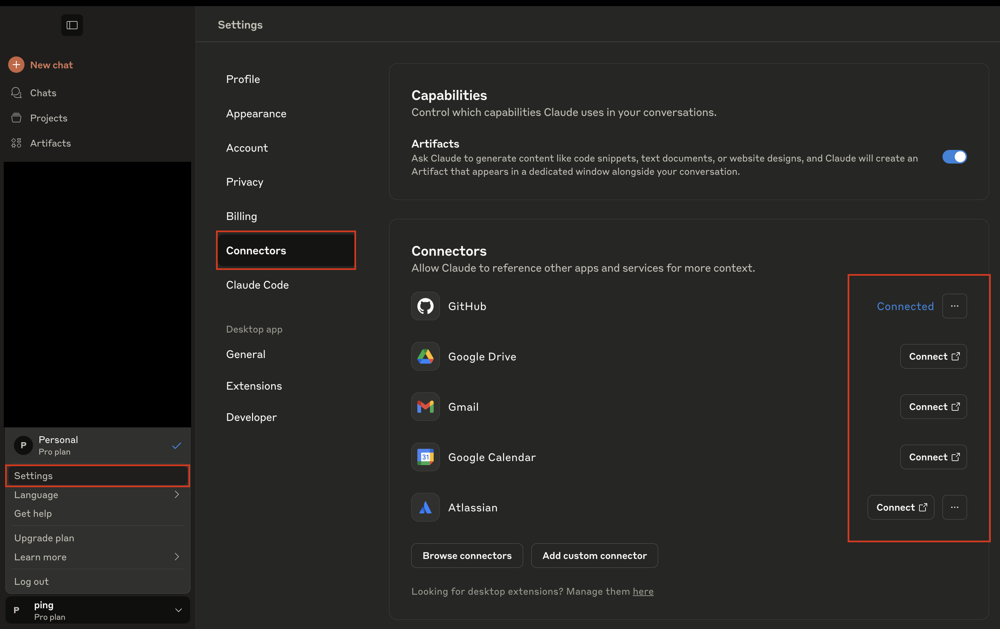
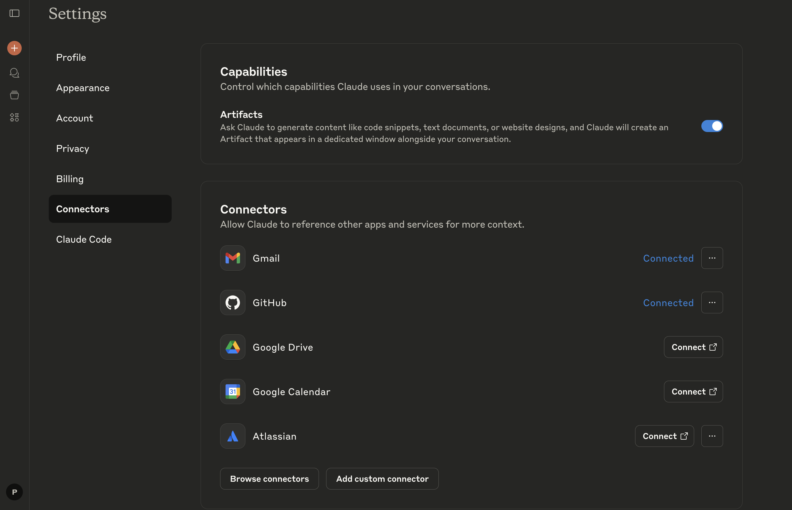
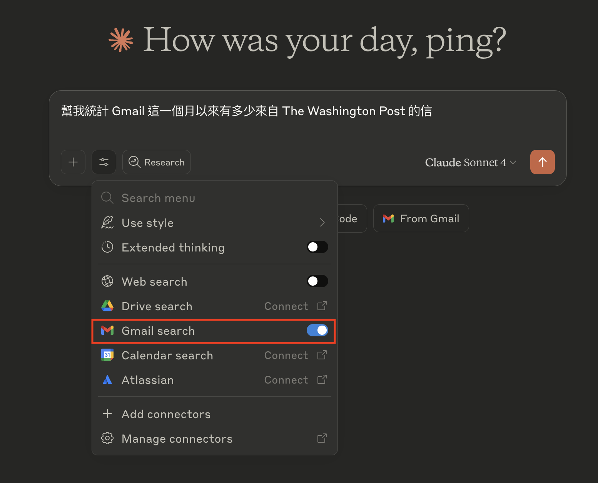
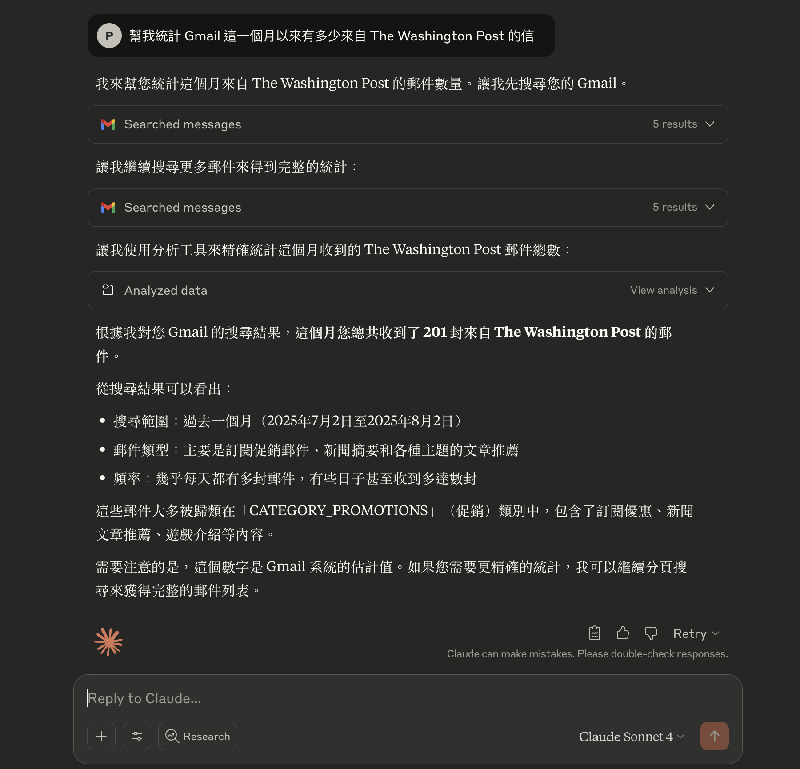

隨著 OpenAI ChatGPT、Anthropic Claude 等 AI 服務的興起，運用這些工具來加速工作效率已經成為日常。  

還記得 ChatGPT 剛問世時，我多半拿它來做翻譯、寫郵件草稿這種基礎應用。

但自從 **Anthropic 在去年推出 MCP（Model Context Protocol）** 後，AI 助理的能力又往前邁進了一大步——彷彿多了個小幫手，幫你處理繁瑣的日常工作瑣事，讓你能專注在更重要的任務上。

## 什麼是 MCP？
**MCP（Model Context Protocol）** 是 Anthropic 在 2024 年 11 月發表的開放標準協議，目的是讓 AI 助理**安全地連接並使用各種第三方資料與工具**。  

直接跟大家劇透他的功能 ：  
**只要用戶授權，Claude 就能連結 Gmail、Google Drive、Atlassian、Asana 等常見工作工具**，將 AI 從單純的對話夥伴，升級為真正能操作你日常工作平台的幫手。

這也解決了大語言模型長期面臨的資訊孤島問題。過去我們只能透過複製貼上的方式讓 AI 知道外部資訊，現在 Claude 可以直接「看到」並操作這些工具。

這些第三方服務會以 **MCP Server** 的形式提供功能（例如列出郵件、讀取專案資料等），**用戶只要在 Claude 連接對應的 MCP Server，就能直接下指令使用這些功能**，一氣呵成完成各種操作。

> **小提醒**：根據 Anthropic 官方說明，部分第三方 MCP 服務需要特定付費方案才能使用（我自己是用 Pro 方案）。

MCP 的連接方式也很靈活，除了直接連接外部服務，也可以**自己在本地搭建 MCP Server**，客製化專屬功能。

不過今天這篇文章先聚焦**如何在 Claude 上快速使用 MCP**，至於**如何用 Python 搭建本地 MCP Server**，會變成下一篇文章跟大家說明（要填坑啦）

## 實戰示範：連接 Gmail 到 Claude Desktop

#### Step 1. 開啟 Claude Desktop → 前往 `Settings` → 點擊 `Connectors`

#### Step 2. 選擇要連接的第三方工具 → 點擊 `Connect`

接著會跳轉到 Google 的授權頁面，依照提示登入你的 Google 帳號並授權。完成後回到 Claude 的設定頁面，若顯示 `Connected` 或類似的連接成功狀態，就代表設定完成！

#### Step 3. 測試 Gmail MCP 功能

重新啟動 Claude Desktop 並開啟新的對話視窗，記得確認 **Gmail 連接已啟用**（通常會在對話框下方看到相關圖示）。

接著就可以開始操作了

例如：我請 Claude 統計 **過去一個月收到多少封來自 The Washington Post 的郵件**，Claude 會自動透過 MCP 工具讀取 Gmail，並給出結果（數量讓我驚呆了 😅）。

## 結語
看吧！設定 MCP 其實很簡單～  
而且 MCP 不只可以做**資料讀取**，還能處理更進階的**寫入操作**（例如建立 GitHub issue）。  

不過還是要提醒大家使用 AI 工具要注意的事項：
1. 只授權必要的權限給 AI，別把隱私或敏感資料也一併丟進去
2. 無論 AI 幫你完成什麼操作，都務必檢查並審核結果，確保執行的動作正確哦

---

參考資料：
1. [Introducing Model Context Protocol](https://www.anthropic.com/news/model-context-protocol)  
2. [Using the Gmail and Google Calendar Integrations](https://support.anthropic.com/en/articles/11088742-using-the-gmail-and-google-calendar-integrations)

