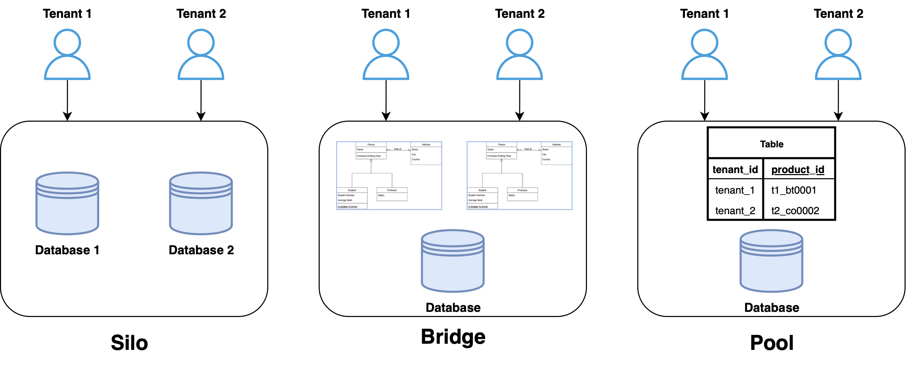

> 最近剛好在研究多租戶架構，發現到多租戶架構的實踐方式其實相當多種，今天要來分享如何使用 PostgresSQL Row Level Security 實踐多租戶吧！

## 何謂多租戶技術？

多租戶 (Multi-tenantcy technology) 是一種軟體設計架構，實作如何在多個不同使用者（租戶）的環境下，讓使用者共用相同的城市、系統資源，並且確保每個使用者的資料都能夠隔離。
舉例來說，Slack 就是多租戶服務的提供者，而使用 Slack 的用戶（如：IBM, Grab ）這些都是租戶。

## 如何實踐多租戶技術？

以資料儲存角度來說，多租戶可以有很多實踐的方式，每種方式在隔離實作上都有優缺點：

**獨立模式 (Silo)**
- 每個租戶獨立使用自己的 DB
- 優點：提供最高程度的隔離
- 缺點：資源成本與維護成本高，因為需要為每個新租戶建立、管理一個新的 DB

**橋接模式 (Bridge)**

-  多個租戶共用 DB ，每個租戶使用 schema 分割
- 優點：能透過資源共享節省部分成本
- 缺點：維運與租戶設定會相對複雜

**共享模式 (Pool)**

- 多個租戶共用 DB 與命名空間
- 租戶的資料都存放在一起，每個資料表或檢視包含一個分割鍵（通常是租戶識別碼），用來篩選各自租戶的資料
- 優點：資源利用率最高、維護簡單、成本低
- 缺點：隔離性低，存在資料洩漏風險

其中維護方式由左到右複雜度越低

## Postgres Row Level Security (RLS)

參考資料：
https://aws.amazon.com/blogs/database/multi-tenant-data-isolation-with-postgresql-row-level-security/
